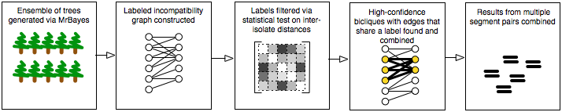

#GiRaF: Robust, Computational Identification of Influenza Reassortments via Graph Mining

[Niranjan Nagarajan](https://www.a-star.edu.sg/gis)1, [Carl Kingsford](http://www.cs.cmu.edu/~ckingsf/)2 
1Genome Institute of Singapore, 2University of Maryland, College Park

##Overview

GiRaF is a computational tool for identification of [reassortments](https://en.wikipedia.org/wiki/Reassortment) in influenza viruses from sequence databases of isolates. Reassortments in influenza - a process where strains exchange genetic segments - have been implicated in 2 out of 3 pandemics of the 20th century as well as the 2009 H1N1 outbreak. GiRaF robustly identifies reassortments in a fully automated fashion while accounting for uncertainties in the inferred phylogenies. GiRaF relies on a fast consensus-search algorithm to confidently identify incompatible gene segment phylogenies that serve as signatures for reassortments. In experiments with synthetic datasets, GiRaF demonstrates high precision and sensitivity as well as robustness to complex reassortment histories. On human, avian and swine influenza datasets, GiRaF correctly identifies known reassortments as well novel events and can automatically catalog reassortment architectures based on all pairwise comparisons between gene segments.

If you use GiRaF, please cite:

Niranjan Nagarajan and Carl Kingsford. [GiRaF: robust, computational identification of influenza reassortments via graph mining](http://nar.oxfordjournals.org/content/39/6/e34), Nuc. Acids Res. 39(6):e34 (2011).

##Download

Source code and executables for GiRaF are freely available. Unless you have a reason to do otherwise, use the latest version. The README.txt file contained in the distribution contains additional instructions about how to run GiRaF.

Version 1.02: fixed crash when tree files contain branch lengths of the form 0.0e+1 (the + character was the problem). 
Older Versions: 
Version 1.01: Faster, more reliable, pre-built Windows, Mac, and Linux executables.

The results obtained using version 1.0 may differ slightly from those obtained using version 0.9. If you want them to be as similar as possible use the command-line option --version-0.9-compat. Even then, version 1.0 and 0.9 can still differ a little bit.

GiRaF is a command-line program that reads NEXUS files (.nex) that contain phylogenetic trees. GiRaF requires some way to build these collections of phylogenetic trees. One such package that has been tested with GiRaF is [MrBayes](http://mrbayes.sourceforge.net/).

##Datasets

Input sequences and corresponding results for the real and synthetic influenza datasets studied using GiRaF can be found here: ftp://ftp.cbcb.umd.edu/pub/data/giraf 
The result files in this directory were generated with version 0.9 of GiRaF.

##Contact

For questions and comments write to niranjan at umiacs.umd.edu.

##Funding

This work was supported by the National Science Foundation [EF-0849899 and IIS-0812111] and the National Institutes of Health [1R21AI085376].
